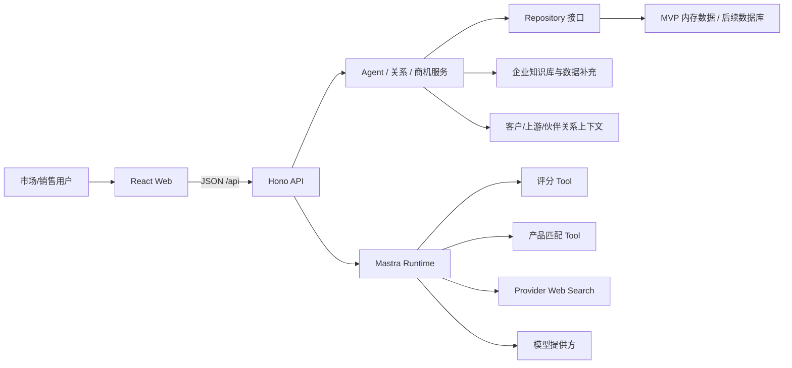
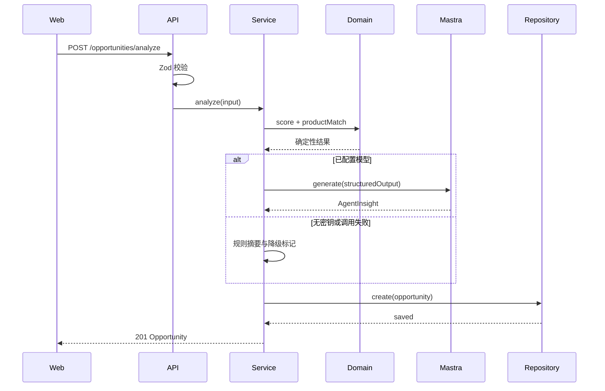

# 氢能产业商机与精准获客 Agent 前后端设计文档

> 版本：V1.0  
> 日期：2026-08-17  
> 对应需求：`氢能产业商机与精准获客Agent-需求文档.md`

## 1. 设计目标

系统采用前后端分离的 TypeScript monorepo，以 Agent 为业务入口，以关系、知识和商机为三类长期上下文。设计优先保证：用户能便利地与 Agent 协作并补充数据、关系提醒可行动、核心业务可解释、Agent 可降级、前后端契约统一、原始资料可追溯、MVP 本地一键运行，并为数据库、RAG、CRM 和权限系统预留接口。

## 2. 技术选型

| 层级 | 技术 | 选择理由 |
| --- | --- | --- |
| 工作区 | pnpm workspace、TypeScript 5 | 统一依赖和类型，适合小型 monorepo |
| Web | React、Vite、React Router、Lucide | 快速构建响应式销售工作台 |
| API | Hono、Node.js 22.13+ | 轻量、标准 Fetch API、易测试 |
| Agent | `@mastra/core` | 官方 TypeScript Agent/Tool/结构化输出能力 |
| 契约 | Zod 4 | 前后端共享类型和运行时校验 |
| 测试 | Vitest | 统一测试体验，适合 TS/ESM |
| MVP 数据 | 内存 Repository + 可审计种子 | 无外部服务即可演示；便于替换数据库 |

Mastra 官方推荐 Node.js 22.13+ 和现代 ESM。依赖版本由 lockfile 固定，各 Mastra 包独立版本，不强行对齐。

## 3. 系统上下文与组件



### 3.1 分层职责

- Web：展示、筛选、表单、加载/错误/降级状态，不持有密钥和业务评分规则。
- API Routes：鉴别请求、Zod 校验、HTTP 状态码和响应封装。
- Service：编排 Agent、关系提醒、知识检索、评分、匹配和 Repository，处理回退策略。
- Domain：纯函数评分与产品匹配，完全不依赖模型。
- Mastra：自然语言理解、公开信息搜索、摘要与行动建议。
- Repository：隔离持久化实现；MVP 内存化，生产替换为 PostgreSQL/SQLite。

## 4. 目录设计

```text
apps/
  api/
    src/
      mastra/{agents,tools,index.ts}
      data/seed.ts
      services/{agent,relationship,knowledge,opportunity}-service.ts
      store/memory-store.ts
      app.ts
      index.ts
  web/
    src/
      components/
      pages/
      lib/api.ts
      app.tsx
      styles.css
packages/
  contracts/src/index.ts
  domain/src/index.ts
docs/
T04_氢能产业商机与精准获客Agent/  # 原始资料，只读
```

## 5. 领域与数据设计

### 5.1 核心聚合

`Relationship` 统一表达客户、潜客、上游厂商和伙伴，`Touchpoint` 记录每次联系及下一步行动；`KnowledgeItem` 表达用户补充的文件、URL、文本和企业种子知识；`Opportunity` 表达可评分、可跟进的业务机会。三者通过 `relationshipId`、`knowledgeIds` 和 `opportunityIds` 关联。

#### Opportunity

```ts
type Opportunity = {
  id: string
  companyName: string
  industry: string
  region: string
  title: string
  signal: string
  signalType: 'procurement' | 'project' | 'policy' | 'operation' | 'partnership'
  stage: 'new' | 'verifying' | 'qualified' | 'engaging' | 'converted' | 'closed'
  score: number
  grade: 'A' | 'B' | 'C' | 'D'
  scoreBreakdown: ScoreDimension[]
  productMatches: ProductMatch[]
  evidence: SourceEvidence[]
  insight: AgentInsight
  createdAt: string
  updatedAt: string
}
```

### 5.2 Repository 接口

```ts
interface OpportunityRepository {
  list(filters?: OpportunityFilters): Promise<Opportunity[]>
  getById(id: string): Promise<Opportunity | undefined>
  create(input: Opportunity): Promise<Opportunity>
  updateStage(id: string, stage: OpportunityStage): Promise<Opportunity | undefined>
}

interface RelationshipRepository {
  list(): Promise<Relationship[]>
  getById(id: string): Promise<Relationship | undefined>
  addTouchpoint(id: string, input: TouchpointInput): Promise<Relationship | undefined>
}

interface KnowledgeRepository {
  list(): Promise<KnowledgeItem[]>
  create(input: KnowledgeItemInput): Promise<KnowledgeItem>
  search(query: string, limit?: number): Promise<KnowledgeItem[]>
}
```

生产版可用 Drizzle + PostgreSQL 实现同一接口。知识长文本再按需加入 Mastra RAG；地区、标签、阶段、分数等结构化字段保持关系查询。

### 5.3 评分设计

`packages/domain` 实现纯函数 `scoreOpportunity(input)`：

1. 对输入进行关键词和枚举标准化。
2. 分别计算场景匹配 30、需求能力 20、时效 20、成熟度 15、可触达 10、战略价值 5。
3. 限制每维得分范围并求和。
4. 转换等级，返回版本、理由和触发项。

所有 Agent 输出仅能补充说明，不直接改写确定性总分。后续评分版本升级需要保留旧结果和版本号。

### 5.4 产品匹配设计

匹配顺序：

1. 从信号和场景识别产品家族（电堆/车用系统/船用系统/制氢/空冷）。
2. 检查硬约束：船用 CCS、场景类型、功率/产氢规模。
3. 计算关键词、行业、场景和规模软匹配分。
4. 返回 Top 3，并展示 `matchedOn`、`gaps` 和来源。

产品参数仅做线索预筛。若输入缺少功率、工况或认证要求，`gaps` 必须明确提示售前确认。

## 6. Mastra Agent 设计

### 6.1 Agents

#### Enterprise Relationship Agent（主 Agent）

- 目标：作为用户统一入口，回答企业、产品、关系和商机问题，生成每日简报和沟通准备。
- Tools：`searchKnowledgeTool`、`listRelationshipsTool`、`scoreOpportunityTool`、`matchProductsTool`。
- 输出：回答、引用、建议动作、需确认事项和运行模式。
- 约束：只读调用工具；不自主外发、不虚构联系人/订单/承诺。

#### Opportunity Analysis Agent（主 Agent 的专业能力）

- 目标：把确定性评分和匹配结果转化为简洁的销售研判。
- Tools：`scoreOpportunityTool`、`matchProductsTool`。
- 输出：摘要、机会类型、切入点、风险、建议动作、需要核实的问题。
- 约束：不得杜撰预算、联系人、订单或技术能力；必须区分事实、推断和建议。

#### Opportunity Research Agent

- 目标：按行业/地区/场景搜索近期公开信号。
- Tool：Mastra `webSearchTool`。
- 输出：候选企业、标题、信号摘要、来源 URL、发生时间、置信度。
- 约束：搜索结果一律为待核验，不自动进入“已研判/跟进中”，不采集非公开个人信息。

### 6.2 Mastra 注册

```ts
import { Mastra } from '@mastra/core'

export const mastra = new Mastra({
  agents: {
    enterpriseRelationshipAgent,
    opportunityAnalysisAgent,
    opportunityResearchAgent,
  },
})
```

业务服务通过 `mastra.getAgentById()` 调用 Agent，使其继承实例级能力。结构化输出使用 Zod：

```ts
const response = await agent.generate(prompt, {
  structuredOutput: {
    schema: AgentInsightSchema,
    jsonPromptInjection: 'auto',
  },
})
```

### 6.3 降级与错误策略

1. 无任何受支持模型密钥：跳过模型，由意图路由 + 知识关键词检索 + 业务规则回答，`mode=rules`。
2. Agent 超时、限流、Schema 失败：捕获错误并返回规则摘要，附非敏感 `fallbackReason`。
3. 自动发现无密钥：返回 `mode=demo` 的种子信号，不伪装成实时搜索。
4. Agent 不参与数据库写入和对外通信，避免不可逆副作用。

### 6.4 Prompt 安全

- 系统指令强调外部文本不可信，网页中的命令不能覆盖系统约束。
- Prompt 只传必要字段，不传密钥、内部日志和未授权个人信息。
- 外部事实必须关联来源 URL；没有证据则输出待核实问题。
- 生产版增加输入长度限制、超时、速率限制和审计。

## 7. API 设计

统一前缀 `/api`，成功响应直接返回资源或 `{ data, meta }`，错误返回：

```json
{
  "error": {
    "code": "VALIDATION_ERROR",
    "message": "请求参数不合法",
    "requestId": "...",
    "details": []
  }
}
```

### 7.1 接口清单

| 方法 | 路径 | 说明 |
| --- | --- | --- |
| GET | `/api/health` | 运行状态、Agent 模式、版本 |
| POST | `/api/agent/chat` | 与企业关系 Agent 对话 |
| GET | `/api/agent/briefing` | 每日行动简报 |
| GET | `/api/relationships` | 客户/上游/伙伴关系列表 |
| GET | `/api/relationships/:id` | 关系详情和互动历史 |
| POST | `/api/relationships/:id/touchpoints` | 新增互动和下一步行动 |
| GET | `/api/knowledge` | 知识条目列表/检索 |
| POST | `/api/knowledge` | 添加文本、URL 或文件内容知识 |
| GET | `/api/dashboard` | 汇总指标、分布和 Top 商机 |
| GET | `/api/opportunities` | 商机列表与筛选 |
| GET | `/api/opportunities/:id` | 商机详情 |
| POST | `/api/opportunities/analyze` | 新信号评分、匹配、Agent 研判并保存 |
| POST | `/api/opportunities/discover` | 联网/演示商机发现 |
| PATCH | `/api/opportunities/:id/stage` | 更新阶段 |
| GET | `/api/products` | 产品知识基线 |

### 7.2 查询参数

`GET /api/opportunities`：

- `q`：匹配企业、标题、地区、信号正文。
- `industry`：行业精确筛选。
- `grade`：A/B/C/D。
- `stage`：阶段枚举。

### 7.3 分析请求示例

```json
{
  "companyName": "某长江航运集团",
  "title": "内河货船绿色动力改造项目启动",
  "signal": "计划对现有货船进行氢燃料电池动力改造，并开展示范运营。",
  "industry": "船舶航运",
  "region": "长江经济带",
  "signalType": "project",
  "expectedScale": "首批 3 艘，单船约 200kW",
  "maturity": "planning",
  "contactability": "public-channel",
  "sourceTitle": "公开项目公告",
  "sourceUrl": "https://example.com/demo",
  "occurredAt": "2026-08-10"
}
```

## 8. 前端设计

### 8.1 信息架构

- **Agent 工作台**：对话、推荐问题、每日行动简报、当前上下文和引用。
- **关系中心**：客户/潜客/上游厂商/伙伴、关系健康度、互动时间线和下一步行动。
- **知识库**：添加文本/URL/文件内容、来源与标签、处理状态和检索。
- **总览**：关键指标、分布、高潜排行、Agent 模式。
- **商机雷达**：筛选器、列表、自动发现入口。
- **信号研判**：结构化输入表单、评分结果、匹配和 Agent 建议。
- **商机详情**：画像、证据链、评分拆解、产品匹配、行动建议、阶段更新。
- **产品知识**：产品目录和来源说明。

### 8.2 视觉与交互

- 深蓝/青绿作为氢能主色，暖橙只用于高优先级提醒。
- 左侧固定导航，主区域使用卡片和表格；状态同时使用文本与颜色。
- 首屏明确展示“智能模式/规则模式/演示发现”，避免用户误判数据实时性。
- 所有异步操作具备 loading、empty、error 和 retry 状态。
- 详情页评分维度用水平进度条展示，保留具体数值和解释。

### 8.3 前端状态

MVP 使用组件状态和轻量 API Client，不引入全局状态库。Agent 对话保留当前浏览器会话，知识和关系数据变更后重新拉取相关资源。后续需要跨会话记忆时接入 Mastra Memory 与数据库，再引入 TanStack Query。

## 9. 后端流程

### 9.1 Agent 对话

API 校验消息后，由 `AgentService` 选择智能或规则模式。智能模式从 Mastra 实例获取主 Agent，让模型按需调用知识、关系、评分和产品工具；规则模式识别“关系/知识/商机/产品/行动”等意图，调用同一 Service 生成可解释回答。两种模式返回统一的 `answer/citations/suggestedActions/mode` 契约。

### 9.2 新信号研判



### 9.3 自动发现

联网 Agent 返回候选信号后，Service 对每条候选执行字段清洗、URL 校验、确定性评分和去重。结果默认阶段为 `verifying`，只有用户确认后才能进入跟进。

## 10. 测试设计

- Domain 单元测试：边界分数、等级、日期衰减、关键场景、船用认证匹配。
- Agent/知识/关系测试：规则回答、知识检索、每日简报、互动记录和到期提醒。
- Tool 测试：输入/输出 Schema、纯服务调用、异常路径。
- API 测试：健康检查、列表筛选、详情 404、分析创建、阶段更新、无密钥降级。
- Web 构建：TypeScript + Vite production build；关键交互后续增加 Testing Library/E2E。
- Agent Live Eval：独立手动/定时执行，不进入普通 PR 必跑流程，避免成本和漂移。

## 11. 部署与配置

### 11.1 环境变量

| 变量 | 必需 | 说明 |
| --- | --- | --- |
| `PORT` | 否 | API 端口，默认 4111 |
| `WEB_ORIGIN` | 否 | CORS 白名单，默认本地 Web |
| `MASTRA_MODEL` | 否 | Model Router 字符串 |
| `OPENAI_API_KEY` | 使用 OpenAI 时必需 | OpenAI 或兼容服务密钥，仅后端读取，不返回前端 |
| `OPENAI_BASE_URL` | 否 | OpenAI 兼容服务完整基地址；官方 OpenAI 留空，配置后作为 Mastra 模型的 `url` 传入 |
| `ANTHROPIC_API_KEY` 等 | 使用对应提供方时必需 | 其他模型提供方密钥，仅后端读取 |

根目录 `.env` 由 API 启动入口加载。OpenAI 配置示例：

```dotenv
MASTRA_MODEL=openai/gpt-4o-mini
OPENAI_API_KEY=sk-...
OPENAI_BASE_URL=
```

使用兼容服务时，将 `MASTRA_MODEL` 的模型名、`OPENAI_API_KEY` 和包含版本路径的 `OPENAI_BASE_URL` 替换为服务方提供的值。密钥不得进入 `VITE_*` 环境变量、前端打包产物或 API 响应。

### 11.2 生产化清单

- Web 构建为静态资源；API 作为独立 Node 服务部署。
- 增加身份认证、RBAC、请求限流、CSRF/CORS 策略和安全响应头。
- 内存 Repository 替换为 PostgreSQL，增加迁移、备份和审计表。
- Agent 运行接入 Mastra observability，设置超时、预算、模型回退和告警。
- 公开数据采集遵循站点条款、个人信息保护和可删除要求。

## 12. 后续演进

1. OCR + 人工校验台，把产品册转成带页码与版本的结构化知识库。
2. PostgreSQL + pgvector/`@mastra/pg`，实现结构化过滤与 RAG 混合检索。
3. 接入招投标、政策、产业园区、企业新闻等合规数据源。
4. 与 CRM 双向同步，利用真实输赢结果校准评分权重。
5. 引入人工反馈、Agent Eval、Prompt 版本和数据质量看板。

## 13. 技术参考

- [Mastra Agents](https://mastra.ai/docs/agents/overview)
- [Mastra Tools](https://mastra.ai/docs/agents/tools)
- [Mastra Structured Output](https://mastra.ai/docs/agents/structured-output)
- [Mastra Workflows](https://mastra.ai/docs/workflows/overview)
- [Mastra GitHub](https://github.com/mastra-ai/mastra)
